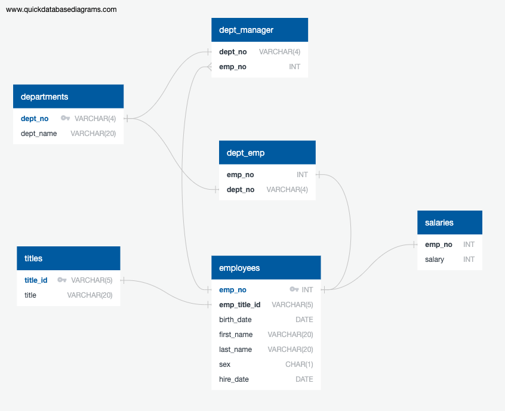

# sql-challenge

This homework uses PostgreSQL as the relational database management system to store and query six tables containing employee information (e.g. name, title, sex, birthday, hire date, and salary).

These six tables store related information as follows:

Besides, access to PostgreSQL database has also been made in Python using the psycopg2 driver. Further analyses were proceeded using Matplotlib for better visualizaiton of the data.

From there, a histogram was generated to find out the most common salary ranges for all employees - from 40k to 50k.

A bar chart was generated to compare the average salaries by title. From this graph, manager's average salary turns out to be lower than staff's average salary, which is not usually the case, implying that this dataset is fake.

After querying the name of the employee ID number 499942, the work is a lovely joke from the boss for April Fools Day!
